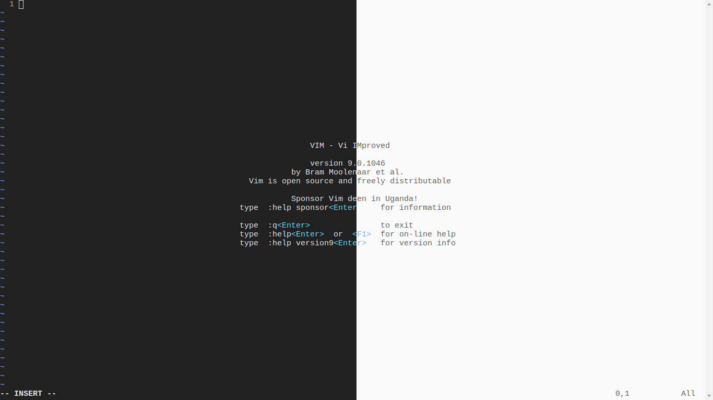

<h1>Terminal</h1>



<h2>Introduction</h2>

<p>Web-based terminal emulator using <a href="https://github.com/xtermjs/xterm.js"><code>xterm.js</code></a>, <a href="https://github.com/microsoft/node-pty"><code>node-pty</code></a>, and <a href="https://github.com/socketio/socket.io"><code>socket.io</code></a>.<p>

Get started by initializing the local web server (defaults to <a href="http://localhost:4173"><code>http://localhost:4173</code></a>):

```console
npm install
npm start
```

<blockquote>See additional <a href="https://github.com/microsoft/node-pty#dependencies">dependencies</a> for different platforms.</blockquote>

<blockquote>Appearance automatically switches depending on device's light and dark mode.</blockquote>

<h2>Copyright</h2>

<p>Copyright &copy; 2022 Yuriuseu. See <a href="LICENSE">LICENSE</a> for details.</p>
